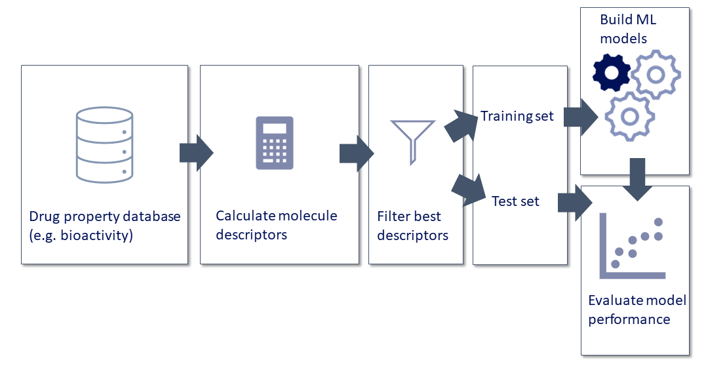

[**Main**](https://github.com/CDDLeiden/QSPRpred/) [](https://github.com/CDDLeiden/QSPRpred/actions/workflows/docs_ci.yml) [](https://github.com/CDDLeiden/QSPRpred/actions/workflows/dev_ci.yml)  

[**Dev**](https://github.com/CDDLeiden/QSPRpred/tree/dev) [](https://github.com/CDDLeiden/QSPRpred/actions/workflows/docs_ci.yml) [](https://github.com/CDDLeiden/QSPRpred/actions/workflows/dev_ci.yml) 

QSPRpred
====================


<p align=left width=70%>

QSPRpred is open-source software libary for building **Quantitative Structure Property
Relationship (QSPR)** model developed by Gerard van Westen's Computational Drug
Discovery group. It provides a unified interface for building QSPR models based on
different types of descriptors and machine learning algorithms. We developed this
package to support our research, recognizing the necessity to reduce repetition in our
model building workflow and improve the reproducibility and reusability of our models.
In making this package available here, we hope that it may be of use to other
researchers as well. QSPRpred is still in active development, and we welcome
contributions and feedback from the community.

QSPRpred is designed to be modular and extensible, so that new functionality can be
easily added. A command line interface is available for basic use cases to quickly,
explore varying scenarios. For more advanced use cases, the Python API offers extra
flexibility and control, allowing more complex workflows and additional features.

Internally, QSPRpred relies heavily on the <a href="https://www.rdkit.org">RDKit</a>
and <a href="https://scikit-learn.org/stable/">scikit-learn</a> libraries. Furthermore,
for scikit-learn model saving and loading, QSPRpred
uses <a href="https://github.com/OlivierBeq/ml2json">ml2json</a> for safer and
interpretable model serialization. QSPRpred is also interoperable
with <a href="https://github.com/OlivierBeq/Papyrus-scripts">Papyrus</a>, a large scale
curated dataset aimed at bioactivity predictions, for data collection. Models developed
with QSPRpred are compatible with the group's *de novo* drug design
package <a href="https://github.com/CDDLeiden/DrugEx/">DrugEx</a>.


Quick Start
===========

## Installation

QSPRpred can be installed with pip like so (with python >= 3.10):

```bash
pip install qsprpred
```

Note that this will install the basic dependencies, but not the optional dependencies.
If you want to use the optional dependencies, you can install the package with an
option:

```bash
pip install qsprpred[<option>]
```

The following options are available:

- extra : include extra dependencies for PCM models and extra descriptor sets from
  packages other than RDKit
- deep : include deep learning models (torch and chemprop)
- pyboost : include pyboost model (requires cupy, `pip install cupy-cudaX`, replace X
  with your [cuda version](https://docs.cupy.dev/en/stable/install.html), you can obtain
  cude toolkit from Anaconda as well: `conda install cudatoolkit`)
- full : include all optional dependecies (requires cupy, `pip install cupy-cudaX`,
  replace X with your [cuda version](https://docs.cupy.dev/en/stable/install.html))

### Note on PCM Modelling

If you plan to optionally use QSPRpred to calculate protein descriptors for PCM, make
sure to also install Clustal Omega. You can get it via `conda` (**for Linux and MacOS
only**):

```bash

conda install -c bioconda clustalo
```

or install MAFFT instead:

```bash
conda install -c biocore mafft
```

This is needed to provide multiple sequence alignments for the PCM descriptors. If
Windows is your platform of choice, these tools will need to be installed manually or a
custom implementation of the `MSAProvider` class will have to be made.

## Use

After installation, you will have access to various command line features and you can
use the Python API directly (
see [Documentation](https://cddleiden.github.io/QSPRpred/docs/)). For a quick start, you
can also check out the [Jupyter notebook tutorials](./tutorials/README.md), which
document the use of the Python API to build different types of models. The tutorials as
well as the documentation are still work in progress, and we will be happy for any
contributions where it is still lacking.

Contributions
=============

Contributions and issue reports are more than welcome. Pull requests can be made
directly to the `main` branch and we will transfer them
to [contrib](https://github.com/CDDLeiden/QSPRpred/tree/contrib) when scheduled for the
next release.

Workflow
========


Current Development Team
========================

- [H. van den Maagdenberg](https://github.com/HellevdM)
- [M. Sicho](https://github.com/martin-sicho)
- [L. Schoenmaker](https://github.com/LindeSchoenmaker)
- [O. Béquignon](https://github.com/OlivierBeq)
- [S. Luukkonen](https://github.com/sohviluukkonen)
- [M. Gorosiola González](https://github.com/gorostiolam)
- [D. Araripe](https://github.com/David-Araripe)
- [C. Jespers](https://github.com/ChielJespers)
- [A. Bernatavicius](https://github.com/andriusbern)
- [R. van den Broek](https://github.com/rlvandenbroek)

