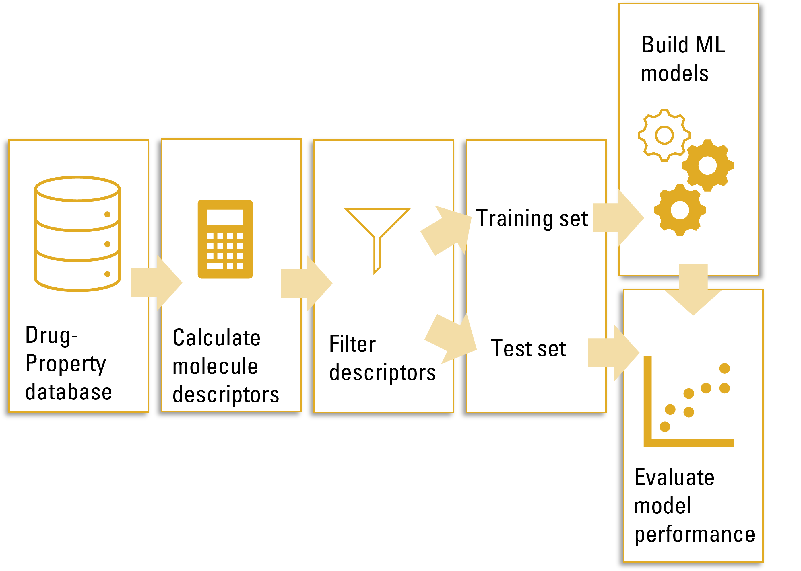

[](https://github.com/marketplace/actions/autopep8)

QSPRpred
====================


<p align=left width=70%>

QSPRpred is open-source software libary for building **Quantitative Structure Property Relationship (QSPR)** model developed by Gerard van Westen's Computational Drug Discovery group. It provides a unified interface for building QSPR models based on different types of descriptors and machine learning algorithms. We developed this package to support our research, recognizing the necessity to reduce repetition in our model building workflow and improve the reproducibility and reusability of our models. In making this package available here, we hope that it may be of use to other researchers as well. QSPRpred is still in active development, and we welcome contributions and feedback from the community.

QSPRpred is designed to be modular and extensible, so that new functionality can be easily added. A command line interface is available for basic use cases to quickly, explore varying scenarios. For more advanced use cases, the Python API offers extra flexibility and control, allowing more complex workflows and additional features. 

Internally, QSPRpred relies heavily on the <a href="https://www.rdkit.org">RDKit</a> and <a href="https://scikit-learn.org/stable/">scikit-learn</a> libraries. Furthermore, for scikit-learn model saving and loading, QSPRpred uses <a href="https://github.com/OlivierBeq/ml2json">ml2json</a> for safer and interpretable model serialization. QSPRpred is also interoperable with <a href="https://github.com/OlivierBeq/Papyrus-scripts">Papyrus</a>, a large scale curated dataset aimed at bioactivity predictions, for data collection. Models developed with QSPRpred are compatible with the group's *de novo* drug design package <a href="https://github.com/CDDLeiden/DrugEx/">DrugEx</a>.


Quick Start
===========

## Installation

QSPRpred can be installed with pip like so (with python >= 3.10):

```bash
pip install git+https://github.com/CDDLeiden/QSPRPred.git@main
```

Note that this will install the basic dependencies, but not the optional dependencies. If you want to use the optional dependencies, you can install the package with the following installation options:

```bash
# include deep neural network models and their dependencies
pip install git+https://github.com/CDDLeiden/QSPRPred.git@main#egg=qsprpred[deep] 

# include extra dependencies for PCM models and extra descriptor sets from packages other than RDKit
pip install git+https://github.com/CDDLeiden/QSPRPred.git@main#egg=qsprpred[extra]

# include all optional dependencies
pip install git+https://github.com/CDDLeiden/QSPRPred.git@main#egg=qsprpred[full]
```

### Multiple Sequence Alignment Provider for Protein Descriptors

If you plan to optionally use QSPRPred to calculate protein descriptors for PCM, make sure to also install Clustal Omega. You can get it via `conda`:

```bash

conda install -c bioconda clustalo
```

This is needed to provide multiple sequence alignments for the PCM descriptors. Clustal Omega does not, however, work on Windows. In that case, you can use MAFFT instead: 

```bash
conda install -c biocore mafft
```

## Use
After installation, you will have access to various command line features, but you can also use the Python API directly (see [Documentation](https://cddleiden.github.io/QSPRPred/docs/)). For a quick start, you can also check out the  [Jupyter notebook tutorials](./tutorial), which documents the use of the Python API to build different types of models. [This tutorial](./tutorial/tutorial_training.ipynb) shows how a QSAR model can be trained. [This tutorial](./tutorial/tutorial_usage.ipynb) shows how to use a QSAR model to predict the bioactivity of a set of molecules. The tutorials as well as the [documentation](https://cddleiden.github.io/QSPRPred/docs/use.html) are still work in progress, and we will be happy for any contributions where it is still lacking.

To use the commandline to train the same QSAR model as in the tutorial use (run from tutorial folder):
```bash
python -m qsprpred.data_CLI -i parkinsons_pivot.tsv -pr GABAAalpha -r true -sf 0.15 -fe Morgan
python -m qsprpred.model_CLI -pr GABAAalpha -r true -m PLS -s -o bayes -nt 10 -me
```

Workflow
========


Current Development Team
========================
- [H. van den Maagdenberg](https://github.com/HellevdM)
- [M. Sicho](https://github.com/martin-sicho)
- [L. Schoenmaker](https://github.com/LindeSchoenmaker)
- [O. Béquignon](https://github.com/OlivierBeq)
- [S. Luukkonen](https://github.com/sohviluukkonen)
- [M. Gorosiola González](https://github.com/gorostiolam)
- [D. Araripe](https://github.com/David-Araripe)
